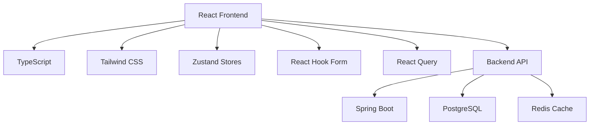

## 1. Arquitetura de Implementação

### 1.1 Stack Tecnológica



### 1.2 Componentes e Dependências

* **Frontend**: React 18 + TypeScript + Vite

* **Estilização**: Tailwind CSS 3 + Headless UI

* **Formulários**: React Hook Form + Zod (validação)

* **Animações**: Framer Motion

* **Ícones**: Lucide React

* **Notificações**: React Hot Toast

* **Temas**: next-themes

## 2. Estrutura de Componentes

### 2.1 Hierarquia de Componentes

```
LoginPage/
├── LoginContainer.tsx
├── LoginForm.tsx
├── PasswordInput.tsx
├── ThemeToggle.tsx
├── ForgotPasswordModal.tsx
├── LoadingSpinner.tsx
└── LoginBackground.tsx
```

### 2.2 Componente Principal - LoginContainer

```typescript
interface LoginContainerProps {
  onLoginSuccess: (user: User) => void;
  onThemeChange: (theme: 'light' | 'dark') => void;
}

const LoginContainer: React.FC<LoginContainerProps> = ({
  onLoginSuccess,
  onThemeChange
}) => {
  // Lógica de container com estado de loading, erros, etc
}
```

### 2.3 Formulário de Login - LoginForm

```typescript
interface LoginFormData {
  username: string;
  password: string;
  rememberMe: boolean;
}

const LoginForm: React.FC<LoginFormProps> = ({
  onSubmit,
  isLoading,
  onForgotPassword
}) => {
  // Formulário com React Hook Form e validação Zod
}
```

## 3. Implementação de Responsividade

### 3.1 Breakpoints e Layout

```css
/* Mobile First Approach */
.container {
  @apply w-full px-4 sm:px-6 md:px-8 lg:px-12;
}

.login-card {
  @apply w-full max-w-sm mx-auto 
         sm:max-w-md 
         md:max-w-lg 
         lg:max-w-xl;
}
```

### 3.2 Grid System Adaptativo

```typescript
const responsiveClasses = {
  container: 'min-h-screen flex items-center justify-center p-4',
  card: 'w-full max-w-md lg:max-w-lg bg-white dark:bg-gray-800 rounded-2xl shadow-2xl',
  form: 'space-y-6 p-6 sm:p-8 md:p-10'
};
```

## 4. Sistema de Temas

### 4.1 Configuração do next-themes

```typescript
// theme-provider.tsx
import { ThemeProvider } from 'next-themes';

export function Providers({ children }) {
  return (
    <ThemeProvider
      attribute="class"
      defaultTheme="system"
      enableSystem
      disableTransitionOnChange
    >
      {children}
    </ThemeProvider>
  );
}
```

### 4.2 Toggle de Tema Component

```typescript
const ThemeToggle: React.FC = () => {
  const { theme, setTheme } = useTheme();
  
  return (
    <button
      onClick={() => setTheme(theme === 'dark' ? 'light' : 'dark')}
      className="p-2 rounded-lg hover:bg-gray-100 dark:hover:bg-gray-700"
    >
      {theme === 'dark' ? <SunIcon /> : <MoonIcon />}
    </button>
  );
};
```

## 5. Validação e Formulários

### 5.1 Schema de Validação com Zod

```typescript
const loginSchema = z.object({
  username: z
    .string()
    .min(3, 'Usuário deve ter pelo menos 3 caracteres')
    .max(50, 'Usuário não pode exceder 50 caracteres')
    .regex(/^[a-zA-Z0-9._-]+$/, 'Caracteres inválidos no usuário'),
  
  password: z
    .string()
    .min(6, 'Senha deve ter pelo menos 6 caracteres')
    .max(100, 'Senha não pode exceder 100 caracteres')
});
```

### 5.2 React Hook Form Implementation

```typescript
const { register, handleSubmit, formState: { errors } } = useForm<LoginFormData>({
  resolver: zodResolver(loginSchema),
  mode: 'onChange'
});
```

## 6. Animações e Interações

### 6.1 Framer Motion Configurations

```typescript
const fadeInUp = {
  initial: { opacity: 0, y: 60 },
  animate: { opacity: 1, y: 0 },
  transition: { duration: 0.6 }
};

const staggerContainer = {
  animate: {
    transition: {
      staggerChildren: 0.1
    }
  }
};
```

### 6.2 Animações de Formulário

```typescript
<motion.form
  variants={staggerContainer}
  initial="initial"
  animate="animate"
  onSubmit={handleSubmit(onSubmit)}
>
  <motion.div variants={fadeInUp}>
    <Input {...register('username')} />
  </motion.div>
</motion.form>
```

## 7. Integração com Backend

### 7.1 API Service Layer

```typescript
// auth.service.ts
class AuthService {
  async login(credentials: LoginCredentials): Promise<AuthResponse> {
    const response = await api.post('/auth/login', credentials);
    return response.data;
  }
  
  async forgotPassword(email: string): Promise<void> {
    const response = await api.post('/auth/forgot-password', { email });
    return response.data;
  }
}
```

### 7.2 Estado Global com Zustand

```typescript
// authStore.ts
interface AuthStore {
  user: User | null;
  isLoading: boolean;
  error: string | null;
  login: (credentials: LoginCredentials) => Promise<void>;
  logout: () => void;
  clearError: () => void;
}
```

## 8. Tratamento de Erros e Loading

### 8.1 Estados de Loading

```typescript
const LoginButton: React.FC<{ isLoading: boolean }> = ({ isLoading }) => (
  <button
    disabled={isLoading}
    className="relative w-full py-3 px-4 rounded-lg font-medium"
  >
    {isLoading ? (
      <div className="flex items-center justify-center">
        <LoadingSpinner className="w-5 h-5 mr-2" />
        Entrando...
      </div>
    ) : (
      'Entrar'
    )}
  </button>
);
```

### 8.2 Sistema de Notificações

```typescript
// toast.config.ts
import toast, { Toaster } from 'react-hot-toast';

export const showSuccessToast = (message: string) => {
  toast.success(message, {
    duration: 4000,
    position: 'top-right',
  });
};

export const showErrorToast = (message: string) => {
  toast.error(message, {
    duration: 5000,
    position: 'top-right',
  });
};
```

## 9. Segurança e Proteção

### 9.1 Rate Limiting no Frontend

```typescript
const useRateLimit = (maxAttempts: number, timeWindow: number) => {
  const [attempts, setAttempts] = useState(0);
  const [isLocked, setIsLocked] = useState(false);
  
  // Lógica de rate limiting
};
```

### 9.2 Proteção de Inputs

```typescript
const sanitizeInput = (input: string): string => {
  return input
    .replace(/[<>]/g, '')
    .trim()
    .slice(0, 100);
};
```

## 10. Testes e Qualidade

### 10.1 Testes Unitários

```typescript
// LoginForm.test.tsx
describe('LoginForm', () => {
  it('should validate username format', () => {
    // Testes de validação
  });
  
  it('should handle form submission', async () => {
    // Testes de submissão
  });
});
```

### 10.2 Testes de Integração

```typescript
// auth.integration.test.ts
describe('Authentication Flow', () => {
  it('should complete full login flow', async () => {
    // Teste de fluxo completo
  });
  
  it('should handle forgot password flow', async () => {
    // Teste de recuperação de senha
  });
});
```

## 11. Performance Optimization

### 11.1 Lazy Loading

```typescript
const LoginBackground = lazy(() => import('./LoginBackground'));
const ForgotPasswordModal = lazy(() => import('./ForgotPasswordModal'));
```

### 11.2 Memoização

```typescript
const LoginForm = memo(({ onSubmit, isLoading }: LoginFormProps) => {
  // Componente memoizado para evitar re-renders desnecessários
});
```

## 12. Deployment e CI/CD

### 12.1 Build Configuration

```typescript
// vite.config.ts
export default defineConfig({
  build: {
    rollupOptions: {
      output: {
        manualChunks: {
          vendor: ['react', 'react-dom'],
          ui: ['@headlessui/react', 'lucide-react']
        }
      }
    }
  }
});
```

### 12.2 Docker Configuration

```dockerfile
# Dockerfile.frontend
FROM node:18-alpine as builder
WORKDIR /app
COPY package*.json ./
RUN npm ci --only=production
COPY . .
RUN npm run build

FROM nginx:alpine
COPY --from=builder /app/dist /usr/share/nginx/html
COPY nginx.conf /etc/nginx/nginx.conf
```

